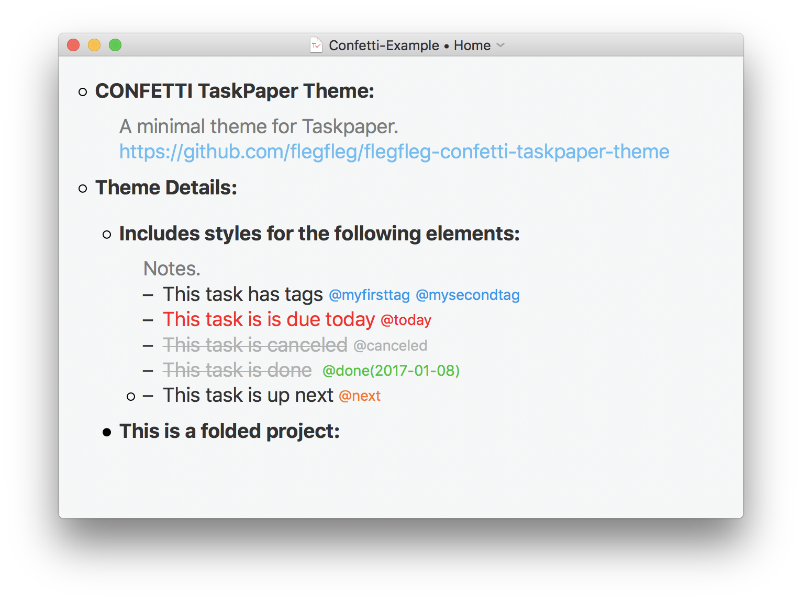

# CONFETTI TaskPaper theme

A minimal theme for TaskPaper, uses the System Font (Apple San Francisco). Based on [wakatara/HelvetiCan-Taskpaper-theme](https://github.com/wakatara/HelvetiCan-Taskpaper-theme) 

## Screenshot

## Installing

1. Window -> Stylesheet -> Open StyleSheet Folder
2. Copy Confetti.less into the folder
3. Activate Window -> Stylesheet -> Confetti.less